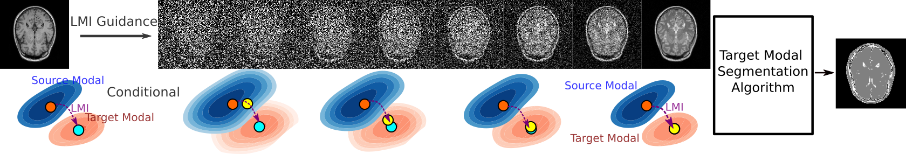

# MIDiffusion
PyTorch implementation of Mutual Information Guided Diffusion for Zero-shot Cross-modality Medical Image Translation

`midiffusion` is a framework designed for zero-shot learning cross modality medical image translation based on diffusion models.

Zihao Wang, Yingyu Yang, Yuzhou Chen, Tingting Yuan, Maxime Sermesant, Hervé Delingette, Ona Wu

| Harvard | Temple | Univ. Göttingen | Inria |

## Overview
Utilizing tools for multi-modal data management offers advantages and challenges. In medical imaging, tools exist for segmenting images in modalities like 3D T1-weighted MRI, but are limited for others like Proton Density-weighted MRI. Using T1w segmentation tools on PDw images could be more efficient than seeking PDw-specific tools. A solution is zero-shot cross-modality image translation, using a diffusion model based on statistical homogeneity to bridge modalities. This approach, illustrated in our model (Locale-based Mutual Information), enables unsupervised zero-shot translation for effective cross-modality segmentation.

Schematic diagram shows the LMI-guided diffusion for zero-shot cross-modal segmentation. The blue and orange contours are source and target distributions. The blue dot in the orange contour represents the target datapoint of the source datapoint (orange dot in the blue contour) in the source distribution. LMIDiffusion uses explicit statistical features (LMI) to navigate the next step (yellow dot), providing continuous guidance (yellow dot) from start to finish. In the end, the translated image can be segmented using arbitrary segmentation methods that were trained only on the target modality.



## Installation

1. Clone the repository:

```bash
git clone https://github.com/yourusername/midiffusion-main.git
cd midiffusion-main
```

2. Install dependencies:

```bash
pip install -r requirements.txt
```

## Usage

### Training

To start a training session, you can use the provided shell scripts:

```bash
./train_commands.sh
```

For training with specific settings, modify the `train_commands.sh` script or run `main.py` with custom arguments.

### Sampling

To generate samples from a trained model:

```bash
./run_sampling.sh
```

### Testing

To evaluate a model or perform tests:

```bash
python test.py
```

## Project Structure

- `configs/`: Configuration files for training and evaluation.
- `datasets/`: Place your dataset files here or scripts to download datasets.
- `functions/`: Core functionalities including model components and utilities.
- `models/`: Definitions of diffusion models and architectures.
- `runners/`: Scripts for different stages of the experiment lifecycle.
- `utils/`: Utility functions and helpers.

## References

This implementation is based on / inspired by:
https://github.com/ermongroup/ddim
https://github.com/ermongroup/SDEdit
https://github.com/ermongroup/ncsnv2
https://github.com/pesser/pytorch_diffusion

